# AWS Cloud Platform — Terraform · EKS · GitOps · DevSecOps

> Terraform으로 3-Tier VPC와 EKS 클러스터를 코드화하고, ArgoCD GitOps로 배포를 자동화하며, Prometheus + Grafana로 관측성을 확보한 클라우드 플랫폼 구축 프로젝트.  
> GitHub Actions OIDC 기반 무자격증명 CI/CD · HPA + Cluster Autoscaler 자동 확장 · Serverless SOAR 보안 자동화까지 통합 구현.

---

## Project Overview

Terraform IaC로 AWS 인프라 전체를 코드화하고, Amazon EKS 위에 GitOps 기반 Platform Engineering 스택을 구축했습니다.  
인프라 배포부터 애플리케이션 운영, 자동 확장, 모니터링, 보안 자동화까지 수동 개입 없이 동작하는 파이프라인을 목표로 설계했습니다.

| 레이어 | 구성 | 핵심 기술 |
| :--- | :--- | :--- |
| **Infrastructure** | 3-Tier VPC + EKS 클러스터 Terraform 코드화 | Terraform, VPC, EKS, IAM |
| **Platform Engineering** | GitOps · 자동 확장 · 네트워크 보안 | ArgoCD, HPA, Cluster Autoscaler, IRSA |
| **CI/CD Automation** | 무자격증명 배포 + 보안 게이트 | GitHub Actions OIDC, Trivy, Bandit |
| **Observability** | 클러스터 메트릭 + WAF 로그 분석 | Prometheus, Grafana, CloudWatch, Athena |
| **Security Automation** | SOAR 파이프라인 + AI 이상 탐지 | Lambda, WAF, Isolation Forest, SNS |

---

## Architecture

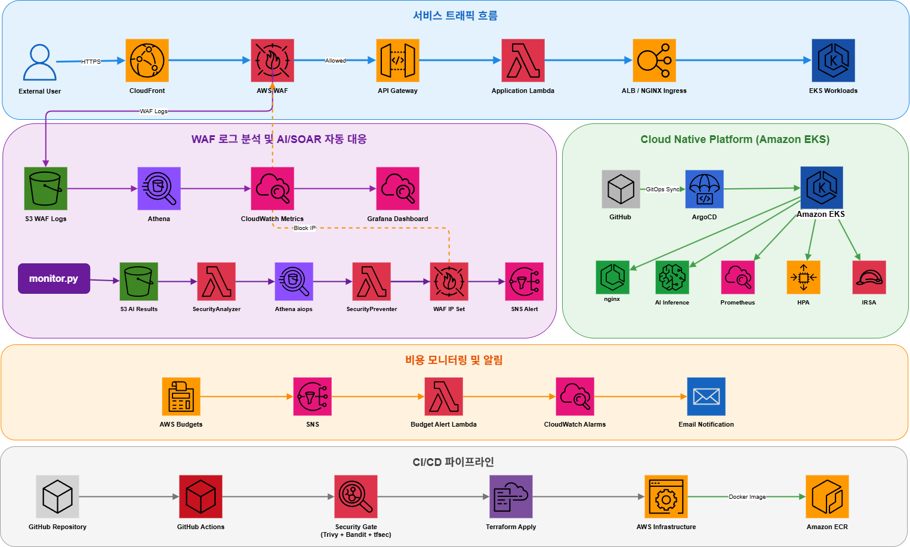

---

## Tech Stack

| 분류 | 기술 |
| :--- | :--- |
| **IaC** | Terraform (모듈: vpc / waf / eks) |
| **Container / Orchestration** | Amazon EKS v1.30, kubectl, Helm, Docker |
| **GitOps** | ArgoCD (App of Apps), kube-prometheus-stack |
| **Auto-scaling** | HPA, Cluster Autoscaler, IRSA (EKS OIDC + IAM Role) |
| **CI/CD** | GitHub Actions (OIDC), Trivy, Bandit, tfsec |
| **Observability** | Prometheus, Grafana, CloudWatch, Athena |
| **Security** | AWS WAF v2, CloudFront, Lambda@Edge, NetworkPolicy |
| **AI/ML** | Scikit-learn (Isolation Forest) |
| **Serverless** | AWS Lambda (3종), API Gateway, S3, SNS, Kinesis |
| **Compliance** | AWS Config (Rules ×11), GuardDuty, CloudTrail, KMS |

---

## 블로그 시리즈

| 편 | 제목 | 핵심 내용 |
| :---: | :--- | :--- |
| [1편](https://velog.io/@yapp/WAF%EB%A7%8C%EC%9C%BC%EB%A1%9C%EB%8A%94-%EB%B6%80%EC%A1%B1%ED%96%88%EB%8B%A4-AI-%EC%9D%B4%EC%83%81-%ED%83%90%EC%A7%80%EB%A5%BC-%EB%B6%99%EC%9D%B8-%EC%9D%B4%EC%9C%A0) | WAF만으로는 부족했다 | 프로젝트 배경, AI 보완의 필요성 |
| [2편](https://velog.io/@yapp/%EB%B3%B4%EC%95%88%EC%9D%80-%EB%B0%B0%ED%8F%AC-%EC%A0%84%EC%97%90-%EC%8B%9C%EC%9E%91%EB%90%9C%EB%8B%A4-AWS-DevSecOps-CICD-%EC%84%A4%EA%B3%84%EA%B8%B0) | 보안은 배포 전에 시작된다 | GitHub Actions OIDC, Terraform 배포 자동화 |
| [3편](https://velog.io/@yapp/03WAF-%EB%A3%B0-5%EB%8B%A8%EA%B3%84%EB%A5%BC-Terraform%EC%9C%BC%EB%A1%9C-%EC%BD%94%EB%93%9C%ED%99%94%ED%95%98%EB%8B%A4) | WAF 룰 5단계를 Terraform으로 코드화하다 | tfsec 수동 보안 점검, WAF Priority 설계 |
| [4편](https://velog.io/@yapp/WAF%EA%B0%80-%EB%86%93%EC%B9%9C-%EA%B2%83%EC%9D%84-AI%EA%B0%80-%EC%9E%A1%EB%8A%94-%EB%B2%95-Isolation-Forest-Shannon-Entropy-%EA%B7%B8%EB%A6%AC%EA%B3%A0-%EC%A0%95%EC%A7%81%ED%95%9C-%ED%95%9C%EA%B3%84) | WAF가 놓친 것을 AI가 잡는 법 | Isolation Forest, 피처 엔지니어링, 모델 평가 |
| [5편](https://velog.io/@yapp/%ED%83%90%EC%A7%80%EC%97%90%EC%84%9C-%EC%B0%A8%EB%8B%A8%EA%B9%8C%EC%A7%80-%EC%9E%90%EB%8F%99%ED%99%94%ED%95%98%EB%8B%A4-SOAR-%ED%8C%8C%EC%9D%B4%ED%94%84%EB%9D%BC%EC%9D%B8%EA%B3%BC-AI-%EB%8C%80%EC%8B%9C%EB%B3%B4%EB%93%9C-%EA%B5%AC%EC%B6%95%EA%B8%B0) | 탐지에서 차단까지 자동화하다 | SOAR 파이프라인, AI 대시보드 구축 |
| [6편](https://velog.io/@yapp/5.-614%EB%A7%8C-%EA%B1%B4%EC%9D%98-KMS-%ED%98%B8%EC%B6%9C-%EB%AC%B4%ED%95%9C%EB%A3%A8%ED%94%84%EA%B0%80-30-%EC%B2%AD%EA%B5%AC%EC%84%9C%EB%A5%BC-%EB%A7%8C%EB%93%A0-%EB%82%A0) | 614만 건의 KMS 호출 — $30 청구서를 만든 날 | CloudTrail 역추적, 비용 최적화 |
| [7편](https://velog.io/@yapp/07.-1.-%EC%84%9C%EB%B2%84%EB%A6%AC%EC%8A%A4-%ED%8F%AC%ED%8A%B8%ED%8F%B4%EB%A6%AC%EC%98%A4%EC%97%90-Kubernetes-%EB%8D%94%ED%95%98%EA%B8%B0-kind%EB%B6%80%ED%84%B0-EKS%EA%B9%8C%EC%A7%80) | Kubernetes AI 추론 서버 컨테이너 배포 | FastAPI 컨테이너화, kind/EKS 배포, Trivy 이미지 스캔 |
| [8편](https://velog.io/@yapp/08.-Terraform%EC%9C%BC%EB%A1%9C-EKS-3-Tier-%ED%94%8C%EB%9E%AB%ED%8F%BC-%EA%B5%AC%EC%B6%95%ED%95%98%EA%B8%B0-ArgoCD-GitOps%EB%B6%80%ED%84%B0-IRSA-%ED%8A%B8%EB%9F%AC%EB%B8%94%EC%8A%88%ED%8C%85) | Terraform으로 EKS 3-Tier 플랫폼 구축하기 | ArgoCD GitOps, HPA, Cluster Autoscaler+IRSA, NetworkPolicy |

---

## ─── Infrastructure 
## 1. Terraform 기반 AWS 인프라 구축

전체 AWS 리소스를 Terraform 모듈로 코드화해 재현 가능한 인프라를 구성했습니다.  
`terraform apply` 한 번으로 VPC부터 EKS 클러스터까지 전체 스택이 프로비저닝됩니다.

```
infra/
├── main.tf          # Provider, S3 Backend + DynamoDB 상태 잠금
├── eks.tf           # EKS 모듈 호출
├── lambda.tf        # Lambda 함수 3종
├── apigateway.tf
├── cloudtrail.tf
├── config.tf        # ISMS Config Rules 11개
└── modules/
    ├── vpc/         # 3-Tier VPC (Public / Private App / Private DB)
    ├── waf/         # Regional WAF v2
    └── eks/         # EKS Cluster + Managed Node Group + IAM Roles
```

### 3-Tier VPC 네트워크 설계

| 서브넷 | CIDR | 용도 |
| :--- | :--- | :--- |
| Public (×2) | 10.0.1–2.0/24 | IGW, NAT Gateway, ELB |
| Private App (×2) | 10.0.11–12.0/24 | EKS Node Group (워크로드 격리) |
| Private DB (×2) | 10.0.21–22.0/24 | 예약 (RDS 확장 고려) |

NAT Gateway를 통해 Private 서브넷 노드가 ECR pull · AWS API를 안전하게 처리합니다.

### WAF 우선순위 설계

| Priority | 규칙 | 근거 |
| :---: | :--- | :--- |
| 0 | GeoBlock-Non-KR | 한국 외 입구 차단 → 하위 룰 검사 비용 절감 |
| 1 | AI-RealTime-Block | AI가 식별한 위협 IP 즉각 차단 |
| 2–4 | AWS Managed Rules | SQLi, XSS 등 알려진 패턴 방어 |
| 5 | IP Reputation List | 평판 불량 IP 차단 |

---

## ─── Platform Engineering 

## 2. Amazon EKS 클러스터 구성

Terraform `eks` 모듈로 EKS 클러스터와 Managed Node Group을 코드화했습니다.

| 항목 | 값 |
| :--- | :--- |
| 클러스터 이름 | `devsecops-eks` |
| K8s 버전 | v1.30 |
| 노드 타입 | t3.medium |
| 노드 수 | desired: 2 / min: 1 / max: 3 |
| 노드 위치 | Private App 서브넷 |
| Endpoint | Public + Private |

```bash
aws eks update-kubeconfig --region us-east-1 --name devsecops-eks
kubectl get nodes
```

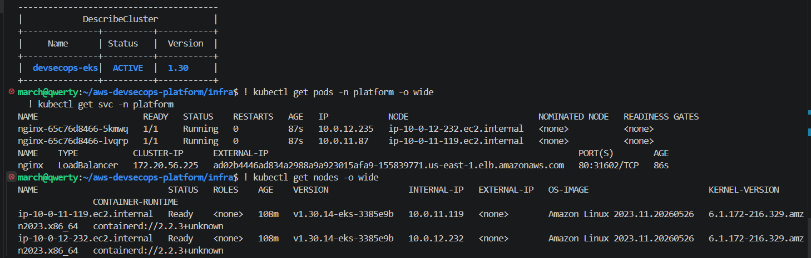

---

## 3. GitOps — ArgoCD App of Apps

**App of Apps 패턴** 으로 단일 루트 Application이 하위 Application 전체를 선언적으로 관리합니다.  
`main` 브랜치에 push하면 ArgoCD가 자동 감지하고 클러스터 상태를 Git과 동기화합니다.

```
gitops/apps/app-of-apps.yaml   ← 루트 Application
      │
      └── gitops/apps/nginx-app.yaml
                │
                └── kubernetes-extension/k8s/nginx/   ← 실제 매니페스트
```

| 설정 | 값 |
| :--- | :--- |
| Project | `minju` |
| Sync Policy | Automated (prune + selfHeal) |
| Target | `main` 브랜치 |
| Destination | `https://kubernetes.default.svc` |

**ArgoCD UI**

| App 카드 | App 리스트 |
|:---:|:---:|
| 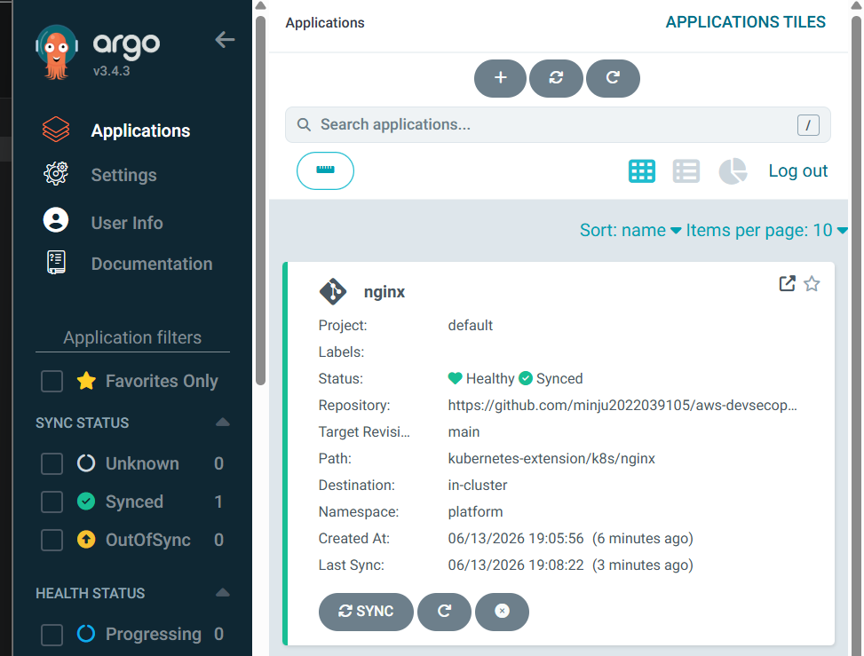 | 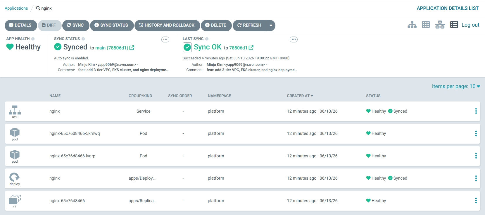 |

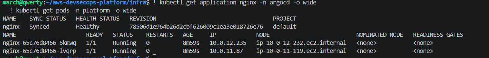

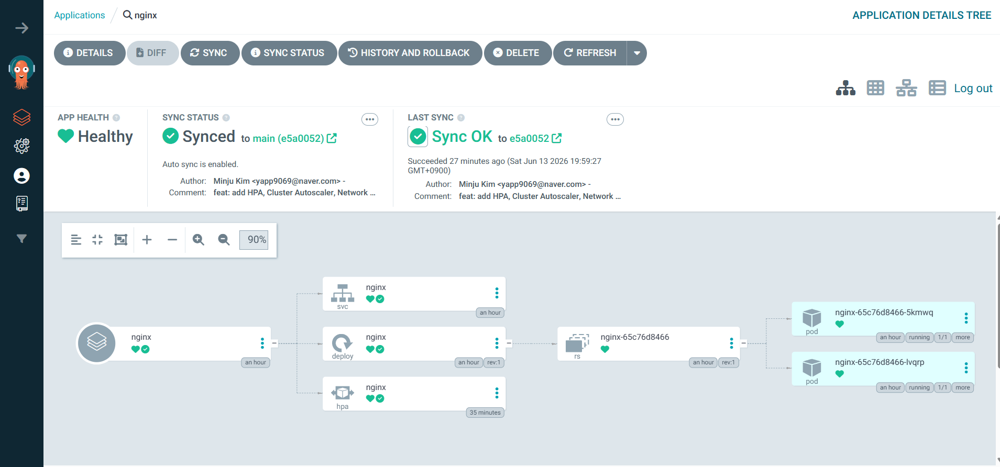


**AppProject minju 설정**

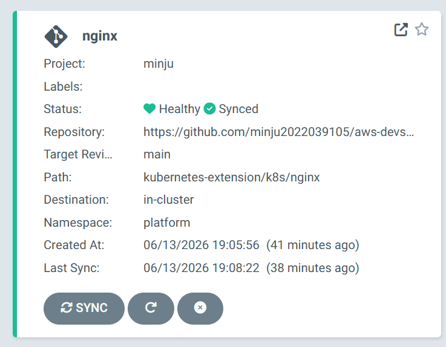

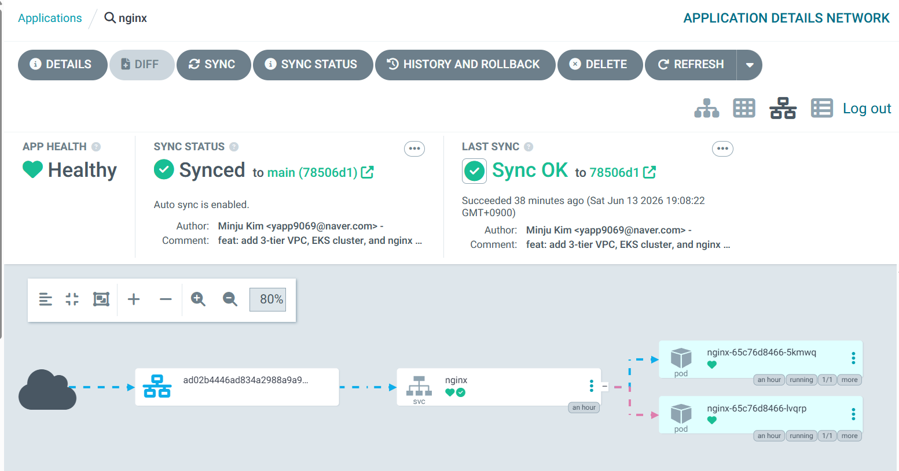

**배포 결과**

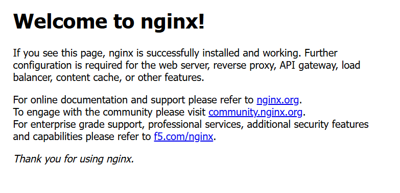

---

## 4. Auto Scaling — HPA + Cluster Autoscaler + IRSA

Pod 레벨 자동 확장(HPA)과 노드 레벨 자동 확장(Cluster Autoscaler)을 함께 구성했습니다.

### HPA (Horizontal Pod Autoscaler)

| 항목 | 값 |
| :--- | :--- |
| 대상 | nginx Deployment |
| CPU 임계치 | 70% |
| minReplicas | 2 |
| maxReplicas | 5 |
| 의존성 | Metrics Server |

```bash
kubectl get hpa -n platform
# NAME    TARGETS      MINPODS   MAXPODS   REPLICAS
# nginx   cpu: 1%/70%  2         5         2
```

### Cluster Autoscaler + IRSA

IMDSv2 hop limit으로 Pod에서 인스턴스 메타데이터 직접 접근이 불가능합니다.  
**IRSA(IAM Roles for Service Accounts)** 로 이를 우회하는 EKS 표준 보안 패턴을 적용했습니다.

```
EKS OIDC Provider
      │  신뢰 정책 (Condition: ServiceAccount 일치)
      ▼
IAM Role (devsecops-cluster-autoscaler-role)
      │  AutoScalingFullAccess + EC2ReadOnlyAccess
      ▼
K8s ServiceAccount (cluster-autoscaler)
      │  eks.amazonaws.com/role-arn 어노테이션
      ▼
Cluster Autoscaler Pod → STS AssumeRoleWithWebIdentity → AWS API
```

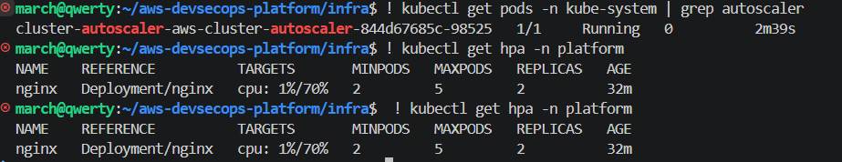

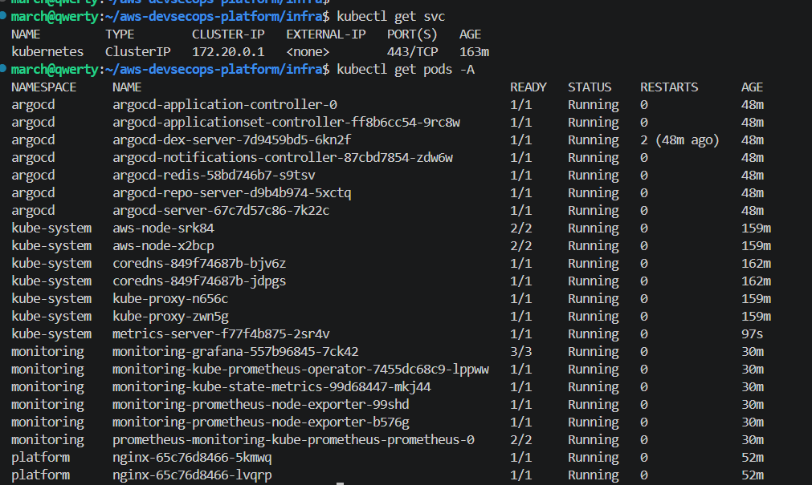

---

## 5. Kubernetes Network Security

**최소 권한 원칙** 을 네트워크 레이어에 적용했습니다.  
platform 네임스페이스 전체 Ingress를 기본 차단하고 nginx Pod만 port 80을 허용합니다.

```yaml
# Policy 1: 기본 차단
kind: NetworkPolicy
metadata:
  name: default-deny-ingress
spec:
  podSelector: {}
  policyTypes: [Ingress]

# Policy 2: nginx port 80만 허용
kind: NetworkPolicy
metadata:
  name: allow-nginx-ingress
spec:
  podSelector:
    matchLabels: { app: nginx }
  ingress:
    - ports: [{ port: 80 }]
```

---

## ─── CI/CD Automation 
## 6. GitHub Actions OIDC 기반 배포 자동화

장기 자격증명(Access Key) 없이 GitHub Actions → AWS 배포를 구현했습니다.

```
GitHub Actions Runner
      │  OIDC Token 발급
      ▼
AWS STS AssumeRoleWithWebIdentity
      │  Condition: repo + main 브랜치 한정
      ▼
github-actions-oidc-role → Terraform apply / Lambda deploy
```

```hcl
Condition = {
  StringEquals = {
    "token.actions.githubusercontent.com:sub" =
      "repo:minju2022039105/aws-devsecops-platform:ref:refs/heads/main"
  }
}
```

초기 `StringLike` → `StringEquals` 재설계로 main 브랜치 push에만 배포 권한을 한정했습니다.  
GitHub Secrets가 유출되어도 이 Condition이 없는 외부 환경에서는 AWS 접근이 불가능합니다.

### Security Gates

코드 변경 시 Trivy · Bandit이 자동 실행되며, 통과하지 못하면 Terraform apply가 차단됩니다.

```
[Push to main]
      │
      ▼
┌─────────────────────┐
│   Security Gates    │  Trivy IaC scan (HIGH/CRITICAL 차단)
│                     │  Bandit Python 코드 분석
└─────────┬───────────┘
          │ 통과 시
          ▼
┌─────────────────────┐
│  Terraform Apply    │  init → plan → apply
│                     │  PR에 Plan 결과 자동 코멘트
└─────────┬───────────┘
          │
          ▼
┌─────────────────────┐
│  Lambda Deploy      │  SecurityAnalyzer / SecurityPreventer
│  + ECR Push         │  NormalTrafficGenerator / Docker Image
└─────────────────────┘
```

| 도구 | 검사 대상 | 기준 |
| :--- | :--- | :--- |
| **Trivy IaC** | Terraform 코드 | HIGH / CRITICAL 차단 |
| **Bandit** | Python Lambda 코드 | Python 보안 취약점 |
| **tfsec** | Terraform 수동 감사 | 로컬 점검 도구 (CI 제외) |

tfsec 수동 점검 결과:

| Before | After |
|:---:|:---:|
| 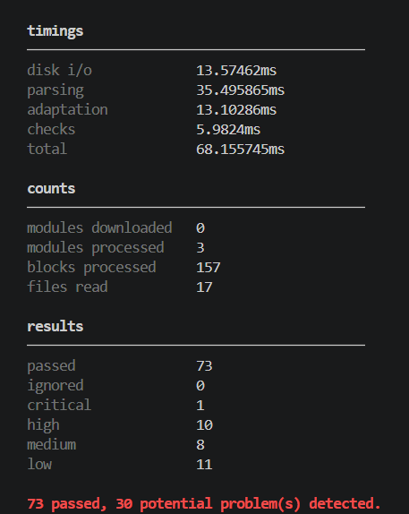 | 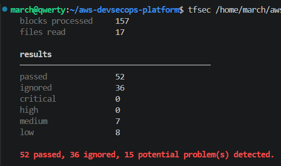 |

Critical 1 → **0**, High 10 → **0** 달성.

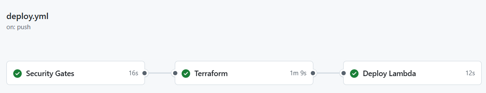

---

## ─── Observability 

## 7. Prometheus + Grafana (In-Cluster)

`kube-prometheus-stack` Helm 차트로 클러스터 내부에 Prometheus + Grafana를 배포했습니다.

```
[In-Cluster]  Prometheus (메트릭 수집)
                └─ Node Exporter, kube-state-metrics
              Grafana (시각화)
                └─ EKS 노드 · Pod · 네임스페이스 대시보드
```

**Grafana — platform 네임스페이스 nginx Pod 리소스**

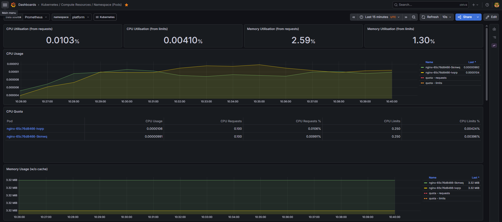

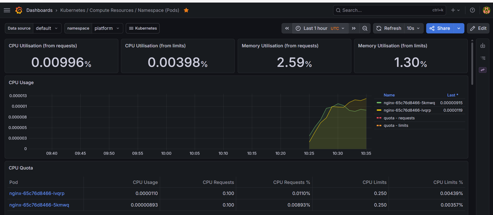

---

## 8. CloudWatch + Athena + Grafana Cloud

WAF · Lambda · API Gateway 운영 메트릭과 보안 로그를 분석합니다.

```
[Production]  WAF / Lambda / API Gateway
               └─ AWS CloudWatch Metrics & Logs

[Analytics]   Grafana Cloud
               └─ Athena (waf_logs, aiops_results) + CloudWatch datasource
```

**Grafana 대시보드 패널**

| 패널 | 데이터소스 | 설명 |
| :--- | :--- | :--- |
| WAF 시간대별 차단 추이 | CloudWatch | BlockedRequests Time series |
| 룰별 차단 건수 | CloudWatch | 4개 룰 분리 Bar chart |
| 공격 유형 분포 | Athena | WAF 로그 기반 Pie chart |
| 국가별 차단 | Athena | Geomap |

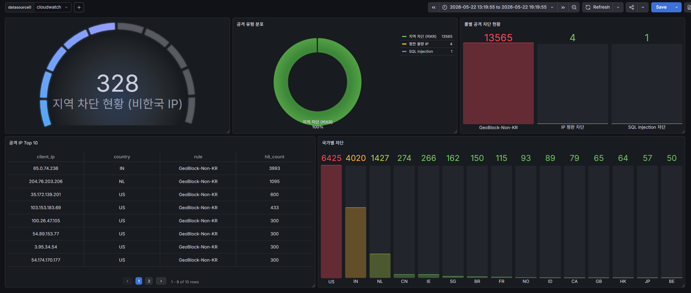

---

## ─── Security Automation
## 9. Serverless SOAR Pipeline

S3에 AI 분석 결과가 적재되는 즉시 Lambda가 위협 IP를 WAF에 자동 등록합니다.

```
monitor.py (AI 추론 결과 생성)
      │  S3 업로드: results/year=Y/month=M/day=D/aiops_*.json
      ▼
S3 ObjectCreated 트리거
      │
      ▼
Lambda: SecurityAnalyzer
      │  Athena aiops_results 쿼리 → anomaly=1 IP 추출
      ▼
Lambda: SecurityPreventer
      ├── WAF IP Set (devsecops-ai-block-list) 자동 업데이트
      └── CloudWatch Namespace: AIOps/Security
```

| 함수 | 역할 |
| :--- | :--- |
| `SecurityAnalyzer` | S3 트리거 → Athena 쿼리 → anomaly IP 추출 → Preventer 호출 |
| `SecurityPreventer` | 위협 IP → WAF IP Set 등록 + CloudWatch 메트릭 기록 |
| `NormalTrafficGenerator` | 6시간마다 정상 트래픽 생성 (AI 모델 학습용) |

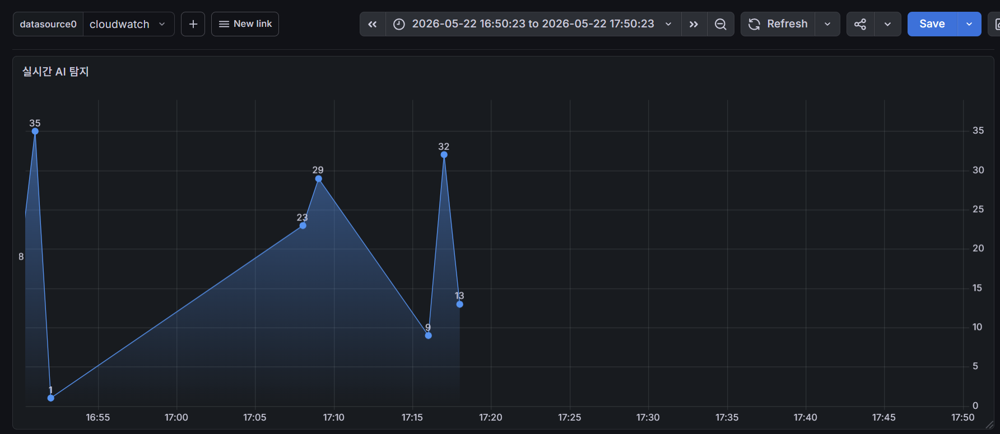

---

## 10. AI 기반 WAF 이상 탐지

AWS WAF 정적 룰이 탐지하지 못하는 변칙적 공격 패턴을 **Isolation Forest** 로 보완합니다.  
SOAR 파이프라인 위에서 동작하는 보안 자동화 레이어입니다.

| 항목 | 내용 |
| :--- | :--- |
| 알고리즘 | Isolation Forest (비지도 학습) |
| 학습 데이터 | 공격 400건 + 정상 1,400건 = **1,800건** |
| contamination | 0.25 / n_estimators | 200 |

**피처 설계 (5개)**

| 피처 | 설명 |
| :--- | :--- |
| `country_code` | GeoIP — 한국 외 IP는 이상치로 분류 |
| `rule_code` | 매칭 WAF 룰 코드 — 동일 룰 반복 = 스캔 공격 징후 |
| `uri_len` | URI 길이 — SQLi 페이로드는 비정상적으로 길어짐 |
| `path_entropy` | URI path Shannon Entropy |
| `args_entropy` | query string Shannon Entropy — SQLi/XSS 탐지 핵심 |

**모델 성능**

| Recall | Precision | F1 | FPR | 처리속도 |
| :---: | :---: | :---: | :---: | :---: |
| **100%** (FN=0) | 30.6% | 0.468 | 16.2% | 0.016ms/건 |

> Recall 100% / FN=0: 공격 미탐 방지 우선 전략. WAF 정적 룰의 사각지대를 보완하는 2차 탐지 레이어.

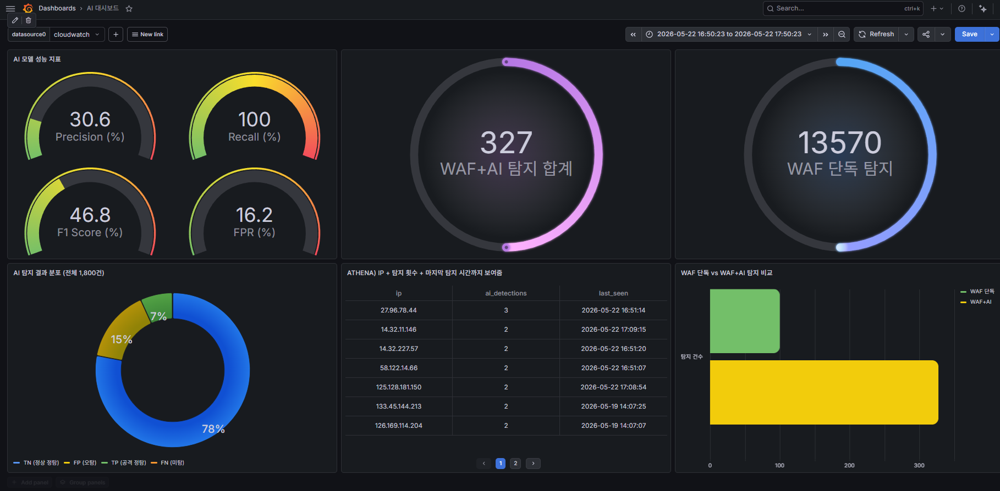

---

## 11. IAM & Network Security

### IAM 최소 권한 설계

| Principal | Role | 설계 의도 |
| :--- | :--- | :--- |
| **GitHub Actions** | `github-actions-oidc-role` | 장기 자격증명 없음. main 브랜치 한정 |
| **Analyzer + Preventer Lambda** | `lambda_blocker_role` | WAF UpdateIPSet만 허용. 생성·삭제 권한 없음 |
| **Lambda@Edge** | `edge_lambda` | S3 models/* GetObject 읽기 전용 |
| **Cluster Autoscaler** | `cluster-autoscaler-role` | IRSA 기반. AutoScaling + EC2ReadOnly만 허용 |

### 지역 차단 이중 방어

| 레이어 | 방법 | 적용 범위 |
| :--- | :--- | :--- |
| CloudFront | `geo_restriction whitelist: KR` | CloudFront 경유 요청 |
| WAF (Priority 0) | `GeoBlock-Non-KR` BLOCK 룰 | API Gateway 직접 접근 |

### 감사 로깅

```
[API 감사]    CloudTrail → S3 (전 리전 + KMS 암호화 + 로그 무결성 검증)
[네트워크]    VPC Flow Logs → CloudWatch 30일 + S3 장기 보관
[리소스 노출] IAM Access Analyzer → 외부 접근 가능 리소스 자동 탐지
```

---

## 12. 컴플라이언스 (ISMS)

Config Rules 11개로 ISMS 통제항목을 자동 점검합니다.

| ISMS 항목 | Config Rule | 상태 |
| :--- | :--- | :---: |
| 2.5 인증·권한관리 | Root 액세스 키 미사용 | ✅ |
| 2.5 인증·권한관리 | IAM 패스워드 정책 (14자, 90일 만료) | ✅ |
| 2.6 접근통제 | S3 퍼블릭 읽기/쓰기 차단 | ✅ |
| 2.6 접근통제 | VPC 기본 보안그룹 비활성화 | ✅ |
| 2.9 로그관리 | CloudTrail 활성화 + 무결성 검증 | ✅ |
| 2.10 시스템 보안 | S3 HTTPS 전용 접근 | ✅ |
| 2.11 사고 대응 | GuardDuty 활성화 | ✅ |

NON_COMPLIANT 감지 → EventBridge → SNS 알림

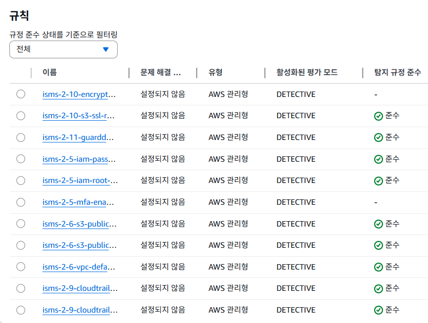

---

## ─── 공통 

## 13. Troubleshooting

| # | 문제 | 원인 | 해결 |
| :--- | :--- | :--- | :--- |
| 1 | KMS 비용 $30/일 급증 | 리소스별 개별 KMS 키 → API 호출 폭증 | 공유 KMS 키 + S3 Bucket Key 전환 |
| 2 | IAM AccessDenied (OIDC) | StringLike Condition → 모든 브랜치 Assume 가능 | StringEquals 재설계, main 브랜치만 허용 |
| 3 | WAF WebACL $5.33/월 누수 | cleanup.sh 의존성 순서 무시 | 삭제 순서 재구성 |
| 4 | sklearn 1.8.0 Private 속성 오류 | 버전 업데이트로 내부 속성 변경 | getattr 기반 안전한 속성 추출 |
| 5 | VPC Default SG 컴플라이언스 위반 | Terraform 외 기본 VPC self-referencing 잔존 | aws_default_security_group으로 Terraform 편입 |
| 6 | KMS MalformedPolicyDocumentException | IAM 사용자 ARN 오타 | waf/main.tf Principal ARN 수정 |
| 7 | kubectl not found | Docker Desktop symlink이 /usr/local/bin/kubectl 점유 | sudo install로 바이너리 직접 교체 |
| 8 | HPA TARGETS `<unknown>` | Metrics Server 미설치 | components.yaml 적용 |
| 9 | Cluster Autoscaler CrashLoopBackOff | IMDSv2 hop limit으로 IMDS 접근 불가 | IRSA(OIDC 기반 STS) 방식으로 전환 |
| 10 | Lambda@Edge 삭제 실패 | CloudFront 복제본 존재 중 삭제 시도 | CloudFront 연결 해제 후 수동 삭제 |

---

## 14. 프로젝트 구조

```
aws-devsecops-platform/
├── infra/                        # Terraform IaC
│   └── modules/
│       ├── vpc/                  # 3-Tier VPC
│       ├── waf/                  # Regional WAF
│       └── eks/                  # EKS Cluster + Node Group
├── lambda/                       # Lambda 함수
│   ├── analyzer/                 # SecurityAnalyzer
│   ├── preventer/                # SecurityPreventer
│   ├── edge_security/            # Lambda@Edge
│   └── traffic_generator/        # NormalTrafficGenerator
├── kubernetes-extension/
│   ├── ai-inference-server/      # FastAPI AI 추론 서버
│   ├── k8s/
│   │   ├── ai-inference/         # AI 추론 서버 매니페스트
│   │   ├── nginx/                # nginx Deployment / Service / HPA
│   │   └── network-policy/       # NetworkPolicy
│   └── helm/
│       ├── ai-inference/         # AI 추론 서버 Helm 차트
│       └── monitoring/           # prometheus-values.yaml
├── gitops/
│   └── apps/                     # ArgoCD App of Apps
├── ai/                           # AI/ML 엔진
│   ├── data/                     # 학습 데이터 (1,800건)
│   ├── models/                   # Isolation Forest, Scaler
│   └── training/                 # train_model.py
├── monitoring/
│   ├── prometheus-demo/          # monitor.py (SOAR 입력 생성기)
│   └── cloudwatch/               # Athena DDL
├── scripts/
│   ├── start.sh                  # 전체 스택 배포 (Terraform + K8s + Helm)
│   ├── stop.sh                   # 전체 스택 삭제
│   └── check_destroyed.sh        # 리소스 삭제 확인
└── docs/
    ├── architecture/             # 아키텍처 다이어그램 + 스크린샷
    ├── Velog/                    # 블로그 포스트 초안
    ├── 작업일지/                  # 날짜별 작업 기록
    └── terraform/                # plan / apply 로그
```

---

## 15. Limitations / Future Work

| 항목 | 현재 구현 범위 | 향후 개선 방향 |
| :--- | :--- | :--- |
| WAF 로그 → AI 추론 | CSV 기반 시뮬레이션. S3 → Lambda → WAF IP Set 파이프라인 검증 완료 | Kinesis Firehose를 통한 실제 WAF 로그 직접 연동 |
| 탐지 정밀도 | Precision 30.6% — FP는 운영자 검토 전제 | 정상 트래픽 라벨 확대 후 contamination 재튜닝 |
| RDS | Private DB 서브넷 예약 완료 | RDS 연동 및 애플리케이션 레이어 추가 |
| Ingress Controller | nginx LoadBalancer 직접 노출 | AWS ALB Ingress Controller + TLS 적용 |
| Federated Learning | 가중 평균 집계 알고리즘 설계·실험 단계 | 실제 분산 노드 환경 운영 검증 |

---

## DevSecOps Pipeline Status: Active
