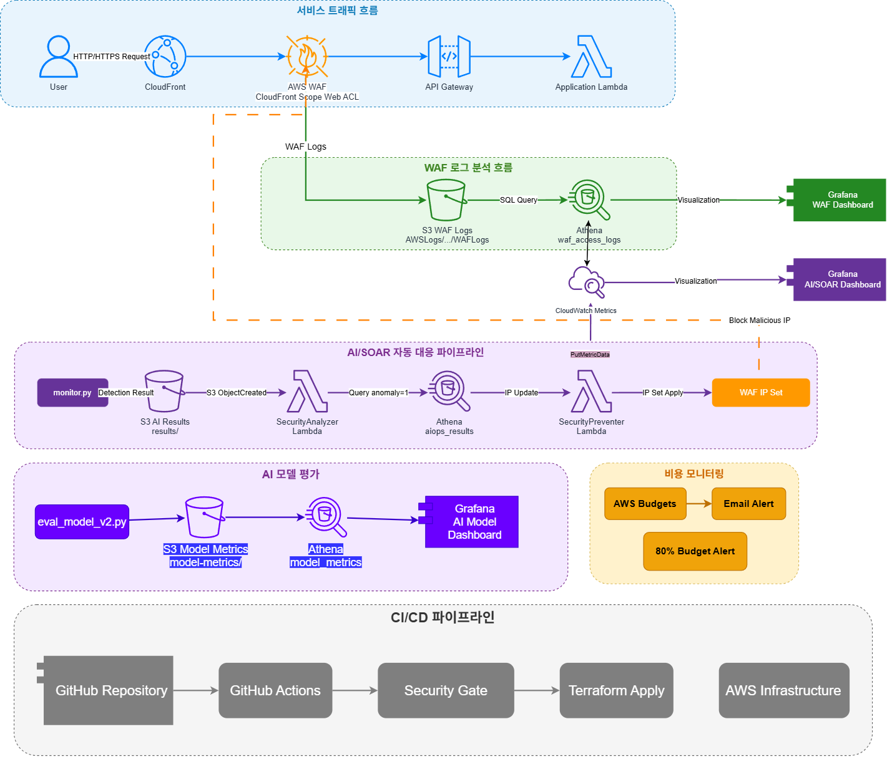
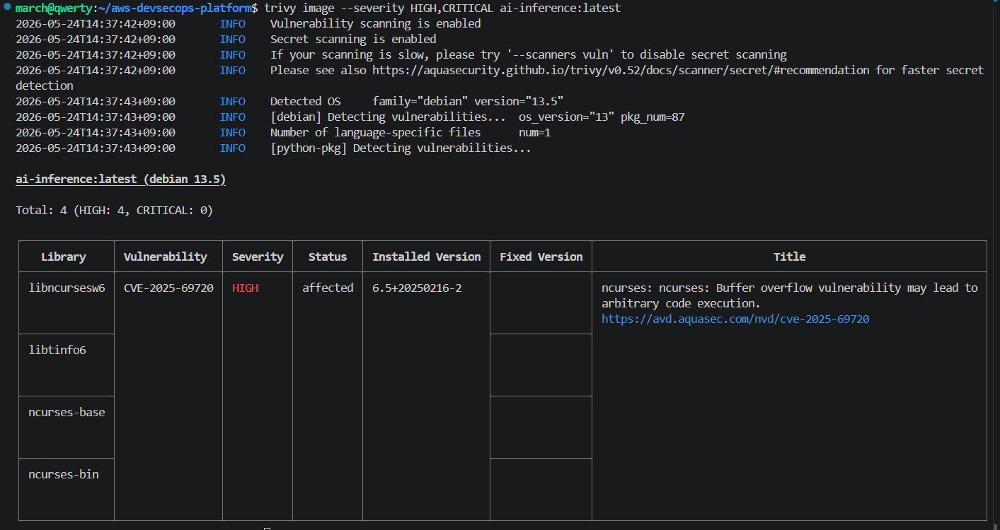
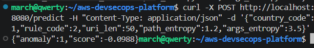

# AWS DevSecOps CI/CD Platform

**GitHub**: https://github.com/minju2022039105/aws-devsecops-platform

> AWS WAF 로그를 기반으로 위협 탐지, 분석, 자동 차단, 보안 검증까지 연결한 클라우드 보안 자동화 플랫폼

---

## 핵심 성과

- GitHub Actions OIDC로 장기 AWS Access Key 없는 배포 구조 구현
- tfsec 기준 Critical 1건 → 0, High 10건 → 0 제거
- S3 → Lambda → WAF IP Set 자동 차단 파이프라인 end-to-end 검증
- Isolation Forest 기반 SQLi 탐지 Recall 100%, FN 0건 달성
- CloudTrail 역추적으로 KMS 호출 폭증 원인 특정 후 일일 $30 비용 정상화

---

## Architecture



---

## 1. DevSecOps CI/CD — 보안을 배포 전에 강제화

**문제**: 인프라 코드와 Lambda 코드에 보안 검증 없이 AWS에 직접 배포되는 구조. 장기 Access Key로 GitHub Actions 인증 — 키 유출 시 계정 전체 노출.

**해결**:
- OIDC 기반 임시 자격증명 채택. `StringLike` 조건은 모든 브랜치에서 역할 Assume이 가능해 `StringEquals`로 교체 — main 브랜치 push에서만 허용.
- Trivy(Terraform IaC)와 Bandit(Python Lambda)을 Security Gate로 직렬 배치. HIGH/CRITICAL 감지 시 Terraform apply 차단.
- tfsec은 CI 워크플로우 안정성 문제로 로컬 수동 감사로 운영. Critical·High 이슈는 배포 전 전량 조치.

```hcl
Condition = {
  StringEquals = {
    "token.actions.githubusercontent.com:sub" =
      "repo:minju2022039105/aws-devsecops-platform:ref:refs/heads/main"
  }
}
```

**결과**:
- 장기 Access Key 완전 제거. GitHub Secrets 유출 시에도 외부 환경에서 AWS 접근 불가.
- tfsec Critical 1 → 0, High 10 → 0
- 모든 인프라 변경이 보안 검증 통과 후에만 배포


| Before | After |
|:---:|:---:|
|  |  |

---

## 2. WAF Rule Architecture — 차단 순서가 곧 비용 설계

**문제**: WAF 룰 순서가 잘못되면 불필요한 검사 비용이 발생. 정적 룰만으로는 변칙 공격 패턴 대응 불가.

**해결**: Priority 0에 GeoBlock-Non-KR 배치 — 한국 외 트래픽을 입구에서 차단해 이후 Managed Rules 검사 비용 절감. Priority 1은 AI가 실시간으로 갱신하는 IP Set으로 구성해 탐지와 차단을 연결.

| Priority | 규칙 | 근거 |
| :---: | :--- | :--- |
| 0 | GeoBlock-Non-KR | 입구 차단으로 이후 룰 검사 비용 절감 |
| 1 | AI-RealTime-Block | AI 식별 위협 IP 즉각 차단 |
| 2–4 | AWS Managed Rules | SQLi, XSS 알려진 패턴 방어 |
| 5 | IP Reputation List | 평판 불량 IP 차단 |

**결과**: CloudFront `geo_restriction`(CF 경로)과 WAF GeoBlock Priority 0(API Gateway 직접 접근) 이중화 — 두 레이어가 서로의 우회 경로를 차단.

---

## 3. Lambda SOAR — 탐지에서 차단까지 자동화

**문제**: WAF 이상 탐지 결과가 나와도 운영자가 수동으로 IP를 WAF에 등록하는 구조 — 대응 지연 발생.

**해결**: S3 ObjectCreated 트리거로 SecurityAnalyzer → SecurityPreventer 파이프라인 구성. Athena로 anomaly=1 IP를 추출한 뒤 WAF IP Set을 자동 업데이트. SecurityPreventer 역할은 WAF IP Set 업데이트만 허용 — WebACL 생성·삭제 권한 없음.

```
AI 탐지 결과 → S3 results/*.json
      ↓ ObjectCreated 트리거
SecurityAnalyzer: Athena 쿼리 → anomaly=1 IP 추출
      ↓
SecurityPreventer: WAF IP Set 자동 등록 + CloudWatch 메트릭 기록
```

**결과**: S3 → Lambda → WAF IP Set 자동 차단 파이프라인 end-to-end 검증 완료. 위협 IP 탐지 후 운영자 개입 없이 자동 차단.


---

## 4. Isolation Forest — WAF 정적 룰의 사각지대 보완

**문제**: WAF 정적 룰은 알려진 패턴만 차단 — 변칙적 SQLi나 저빈도 공격에 사각지대 존재. 레이블 없는 운영 환경에서 지도 학습 적용 불가.

**해결**: 정상 트래픽 분포를 기준으로 이상치를 탐지하는 비지도 학습 Isolation Forest 선택. AWS WAF 로그의 `uri`와 `args`를 분리해 각각 Shannon Entropy 측정 — SQLi 페이로드가 query string에 집중되기 때문에 단일 `uri_entropy`로는 탐지력이 낮았음.

| 피처 | 설명 |
| :--- | :--- |
| `args_entropy` | query string 엔트로피 — SQLi 탐지 핵심 피처 |
| `path_entropy` | URI path 엔트로피 |
| `uri_len` | 비정상적으로 긴 URI = SQLi 페이로드 징후 |
| `country_code` | 한국 외 IP 이상치 분류 |
| `rule_code` | 동일 룰 반복 = 스캔 공격 징후 |

**결과** (SQLi 100건 + 정상 1,350건 = 1,500건 기준):

| 지표 | 값 |
| :--- | :---: |
| Recall | **100%** |
| FN | **0건** — 공격 미탐 0 |
| FPR | 16.2% (FP 227건, 운영자 검토 대상) |
| 처리 속도 | **0.016ms/건** — 실시간 처리 가능 |

WAF 정적 룰 차단 100건 + AI 이상 후보 227건 = 총 보안 검토 대상 327건으로 확장.


---

## 5. Athena + Grafana — 속도와 분석 깊이의 분리

**문제**: CloudWatch만으로는 원본 WAF 로그(IP, URI, 국가)에 접근 불가. OpenSearch는 클러스터 운영 비용이 과도. 로컬 Prometheus는 외부 Grafana Cloud에서 접근 불가.

**해결**: CloudWatch(집계 메트릭, ~1분)와 Athena(S3 원본 로그 SQL 분석, ~5~15분)를 역할에 따라 분리. Grafana Cloud에서 두 데이터소스를 단일 대시보드로 통합.

- **CloudWatch**: 차단 건수 급증 즉각 감지 → 긴급 대응
- **Athena**: 공격 IP Top10, 국가별 분포, URI 패턴 → 원인 분석

**결과**: WAF 메트릭 + AI 모델 성능 + 원본 로그를 단일 화면에서 관제. ISMS Config Rules 11개 NON_COMPLIANT 감지 → EventBridge → SNS 자동 알림.


---

## 6. KMS 비용 폭증 — $30/일 원인 추적 및 정상화

**문제**: 일일 비용이 갑자기 $30까지 급증. 원인 불명.

**추적**: Cost Explorer로 KMS 비용 급증 확인 → CloudTrail로 API 호출 출처 역추적 → 리소스별 개별 KMS 키 생성으로 614만 건/일 호출 발생이 원인임을 특정.

**해결**: 공유 KMS 키 구조로 전환 + S3 Bucket Key 활성화로 S3 → KMS 직접 호출 횟수 대폭 감소.

**결과**: KMS 호출 정상화, 일일 $30 비용 구조 개선.

---

## 7. Kubernetes Extension — 동일 AI 엔진의 컨테이너 배포 검증

서버리스(Lambda)로 운영 중인 AI 추론 엔진을 컨테이너 환경에서도 동일하게 배포할 수 있는지 검증.

| 단계 | 내용 |
| :--- | :--- |
| Phase 1 (로컬) | FastAPI 추론 서버 컨테이너화 → kind 배포 → `/predict` 검증 |
| Phase 2 (EKS) | ECR push → EKS 실배포 → 엔드포인트 검증 |

Helm 차트 단일 명령 배포, Rolling Update / Rollback 검증, Trivy 이미지 스캔 CRITICAL 0건.





---

## Tech Stack

| 분류 | 기술 |
| :--- | :--- |
| Infrastructure / CI/CD | Terraform, GitHub Actions (OIDC), Trivy, Bandit, tfsec |
| Security | AWS WAF v2, CloudTrail, AWS Config, GuardDuty, KMS |
| Serverless | AWS Lambda, API Gateway, CloudFront |
| AI/ML | Scikit-learn (Isolation Forest) |
| Monitoring | Grafana Cloud, CloudWatch, Athena, SNS |
| Container | Docker, Kubernetes (kind / EKS), Helm, ECR |

---

*DevSecOps Pipeline Status: 진행중*
