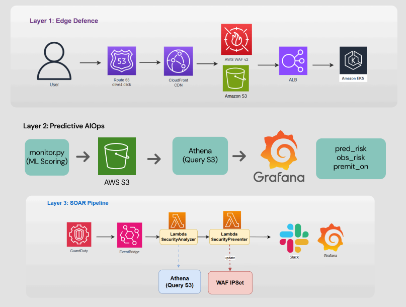
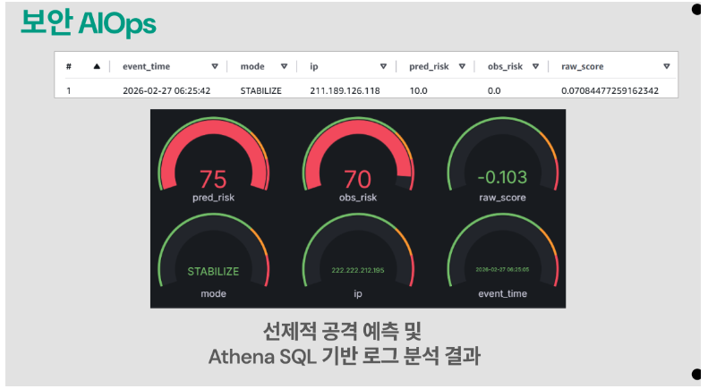
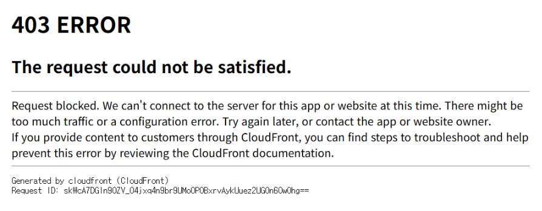

# Security Engineer Portfolio

**GitHub (DevSecOps)**: https://github.com/minju2022039105/aws-devsecops-platform  
**GitHub (AIOps)**: https://github.com/minju2022039105/Security-AIOps-IsolationForest  
**Velog**: https://velog.io/@yapp

---

## 핵심 역량

- **구조 설계 기반 문제 해결** — 장애 원인을 설정값이 아닌 트래픽 흐름·아키텍처 차원에서 추적. KMS 비용 무한루프와 WAF 차단 미작동을 구조 재설계로 해결
- **보안 내재화된 CI/CD 운영** — 장기 자격증명 없는 OIDC 배포 구조 설계. IaC·코드·이미지 단계별 보안 게이트로 배포 전 취약점 자동 차단
- **탐지에서 차단까지의 자동화** — WAF·GuardDuty·Lambda·Athena를 연결한 SOAR 파이프라인 설계. AI 이상 탐지 결과를 차단 정책에 자동 반영
- **컴플라이언스와 관제 가시성** — ISMS 통제항목을 Config Rules로 상시 점검. Grafana 대시보드로 위험도와 차단 현황 실시간 시각화

---

## Project 1. AWS 3-Layer Security AIOps Platform

> 6인 팀 프로젝트 | 역할: 6인 팀 프로젝트 | 담당: CloudFront·WAF 기반 보안 아키텍처 설계, GuardDuty·Lambda SOAR 구현, 공격 차단 검증 | 클라우드웨이브 7기 (AWS 파트너사 주관 실무 부트캠프) | 2026.02 (3주)  
> GitHub: https://github.com/minju2022039105/Security-AIOps-IsolationForest

| 제약 | 설계 결정 |
| :--- | :--- |
| $1,200 크레딧으로 3주간 EKS 운영 | Edge에서 악성 트래픽 선제 차단 → EKS 오토스케일링 방지 |
| 실운영 로그 레이블 부재 | Isolation Forest 비지도 학습으로 정상 패턴 이탈 탐지 |

---

### 아키텍처



**핵심 설계 결정**
- WAF Managed Rules · Geo Restriction · Dynamic IP Reputation으로 Edge에서 악성 트래픽 차단
- Isolation Forest 비지도 학습으로 레이블 없는 실운영 로그 이상 탐지
- GuardDuty + Lambda 기반 SOAR 파이프라인 자동 구축 (실행 지연 46ms, warm Lambda 기준)
- OpenSearch 대신 LGP Stack(Grafana · Athena · CloudWatch) 채택으로 운영 비용 80% 절감

---

### 탐지 성능



- 정찰 단계 이상 패턴 감지, **약 60초 선행 탐지** (직접 작성한 시뮬레이션 스크립트 기준, 단일 시나리오)
- Dynamic Threshold 적용 — **Recall 100%**, FN 0건 (SQLi 페이로드 100건 직접 생성 기준)
- FPR 16.2% — AI 탐지는 운영자 검토 대상 분리, 자동 차단은 고신뢰 이벤트에 한정

---

### 차단 검증



SQLi · Log4j · 해외 IP · GuardDuty 탐지 등 공격 유형 4가지 실 환경 차단 검증. GuardDuty Finding severity HIGH 이상을 EventBridge로 수신해 Lambda가 WAF IPSet을 자동 갱신합니다.

---

### SOAR Pipeline


GuardDuty Finding을 기반으로 Analyzer Lambda가
Athena 로그를 조회하고, 공격 유형을 분류한 뒤
Preventer Lambda가 WAF IPSet을 갱신하도록 구현했습니다.

---

### 핵심 트러블슈팅

- **WAF 차단 미작동**: 트래픽 흐름·우회 경로·룰 우선순위 3가지 축으로 원인 분리 → ALB Security Group을 CloudFront Prefix List 전용으로 제한
- **Private Subnet Fargate 통신 장애**: Fargate Pod가 STS/S3에 접근하지 못하는 원인을 Private Subnet의 외부 경로 부재로 특정 → VPC Endpoint 기반 AWS 서비스 접근 구조로 재설계
---

## Project 2. AWS DevSecOps CI/CD Platform

> 개인 프로젝트 | CI/CD Security Gate · OIDC · IaC 보안 감사 · ISMS 자동 점검 구현 완료, 확장 진행 중  
> GitHub: https://github.com/minju2022039105/aws-devsecops-platform

Project 1에서 다루지 못한 CI/CD Security Gate, IaC 전체 코드화, ISMS 컴플라이언스 자동화를 서버리스 단독 환경에서 구현.

| 제약 | 설계 결정 |
| :--- | :--- |
| 배포 과정에서 장기 AWS Access Key 사용 위험 | GitHub Actions OIDC 기반 무자격증명 배포 구조로 전환 |
| Terraform 코드 배포 전 보안 검증 부재 | Trivy · Bandit · tfsec 기반 Security Gate로 취약점 사전 차단 |
| ISMS 통제항목 점검의 수동 운영 한계 | AWS Config Rules 11개로 컴플라이언스 자동 점검 구조 구현 |

---

### 아키텍처

<p align="center">
  
</p>

<p align="center"><em>GitHub Actions 기반 Security Gate와 Terraform IaC를 중심으로 구축한 서버리스 DevSecOps 플랫폼</em></p>

**핵심 설계 결정**
- GitHub Actions OIDC로 장기 자격증명 없는 AWS 배포 구조 구현
- Trivy · Bandit · tfsec 기반 Security Gate로 취약점 검증 후에만 Terraform Apply 수행
- Terraform으로 AWS 보안 인프라를 코드화해 재현성과 변경 추적성 확보
- AWS Config Rules 11개로 ISMS 통제항목 상시 점검 및 NON_COMPLIANT 자동 알림
- 서버리스 기반 보안 자동화 구조로 운영 부담을 줄이고 WAF·Lambda·Athena·Grafana 관제 흐름 구현

---

### CI/CD Security Gate


Security Gates(Trivy IaC · Bandit)를 통과하지 못하면 Terraform apply가 실행되지 않도록 설계했습니다. GitHub Actions OIDC로 장기 자격증명 없이 AWS 역할을 Assume하는 배포 구조를 구현했습니다.

```hcl
Condition = {
  StringEquals = {
    "token.actions.githubusercontent.com:sub" =
      "repo:minju2022039105/aws-devsecops-platform:ref:refs/heads/main"
  }
}
```

초기 `StringLike` → `StringEquals`로 재설계해 main 브랜치 push에만 배포 권한을 한정했습니다. GitHub Secrets가 유출되더라도 외부 환경에서의 AWS 접근을 차단합니다.

---

### IaC 보안 감사 — tfsec

| 조치 전 | 조치 후 |
|:---:|:---:|
|  |  |

Critical 1 → **0**, High 10 → **0** 달성. Cognito 패스워드 재사용 방지 강화, S3 SSL 전용 접근 정책 추가. 설계상 감수한 항목은 `tfsec:ignore` 주석에 사유를 명시했습니다.

---

### ISMS 컴플라이언스 자동 점검


AWS Config Rules 11개로 ISMS 통제항목(2.5 인증·권한관리 / 2.6 접근통제 / 2.9 로그관리 / 2.10 시스템보안 / 2.11 사고대응)을 자동 점검했습니다. NON_COMPLIANT 감지 시 EventBridge → SNS 알림을 자동 발송합니다.

---

### AI 이상 탐지 — 피처 설계 심화


AWS WAF 로그의 URI path와 query string을 분리해 `path_entropy` · `args_entropy`를 독립 피처로 설계했습니다. SQLi 페이로드는 query string에 집중되므로 단일 `uri_entropy`만으로는 탐지력이 제한됨을 확인하고 개선했습니다.

| Recall | FPR | 처리 속도 |
|:---:|:---:|:---:|
| **100%** (FN=0) | 16.2% | 0.016ms/건 |

FPR 개선 방향으로 임계값 튜닝 및 `request_rate` 피처 추가를 검토 중입니다.

---

### 차단 검증

SQLi · Log4j · 해외 IP · GuardDuty 탐지 등 공격 유형 4가지에 대해 WAF 차단 동작을 검증했습니다.

---

### Kubernetes Extension


동일 AI 추론 엔진을 kind → EKS 순서로 컨테이너 배포 검증했습니다. CRITICAL 0건, Helm Rolling Update / Rollback 적용.

---

### 핵심 트러블슈팅

- **KMS $30/일 급증**: Cost Explorer · CloudTrail로 호출 출처 역추적 → 공유 KMS 키 + S3 Bucket Key 전환
- **OIDC Condition 취약**: StringLike → StringEquals 재설계로 main 브랜치 배포만 허용
- **WAF WebACL 삭제 실패**: cleanup.sh 의존성 순서 무시 원인 파악 → 삭제 로직 재정리
